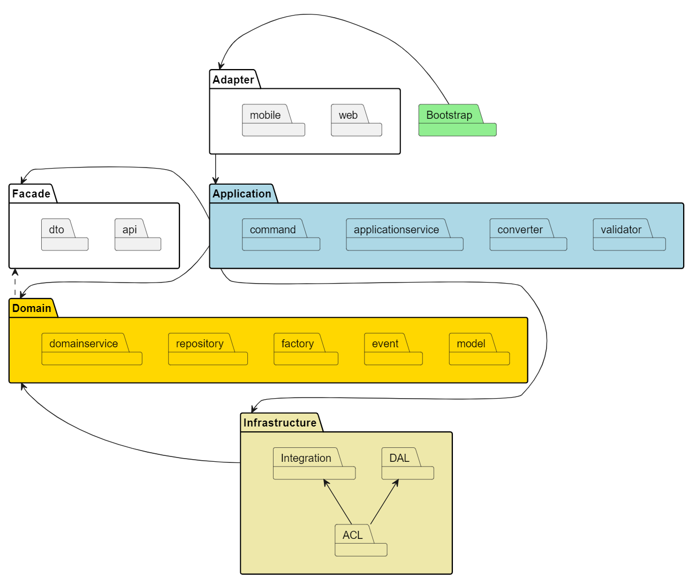
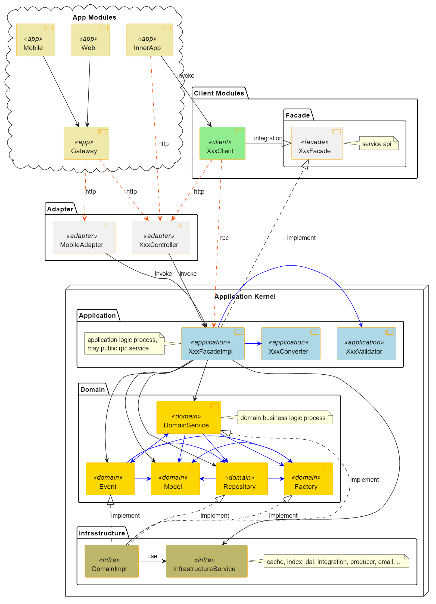

# DDLA 借用日语发音“哆啦”

DDLA (Domain driven design layered architecture)， 结合了领域驱动设计思想和六边形架构思想，是DDD实践下的一种分层架构。

## 应用架构

### 架构分层


### 组件依赖



### 数据依赖


## 架构规范

### 应用目录结构

```bash
.
|-- app
|   |-- adapter
|   |-- application
|   |-- domain
|   |-- facade
|   `-- infrastructure
|       |-- acl
|       |-- dal
|       |-- integration
|-- bootstrap
|-- conf
`-- test
```

### 工程实践规范
|module|module描述|package|package描述|规范|
|---|---|---|---|---|
|adapter|适配器||||


## DDLA使用

使用如下maven命令，替换**groupId**、**artifactId**、**version**、**package**等参数为你期望的值。

```shell
mvn archetype:generate \
    -DgroupId=com.lazycece.ddlademo \
    -DartifactId=ddlademo \
    -Dversion=1.0.0-SNAPSHOT \
    -Dpackage=com.lazycece.ddlademo \
    -DarchetypeArtifactId=ddla-archetype \
    -DarchetypeGroupId=com.lazycece.ddla \
    -DarchetypeVersion=${ddla-archetype.version}
```

## License

[Apache-2.0](https://www.apache.org/licenses/LICENSE-2.0.html)